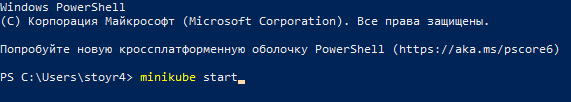
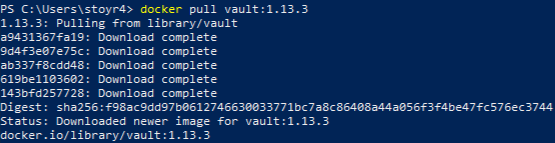
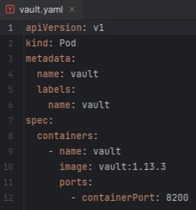
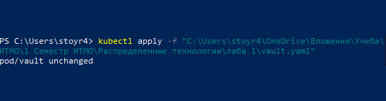
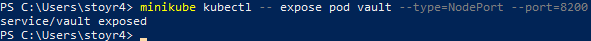
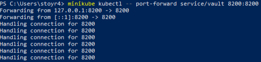
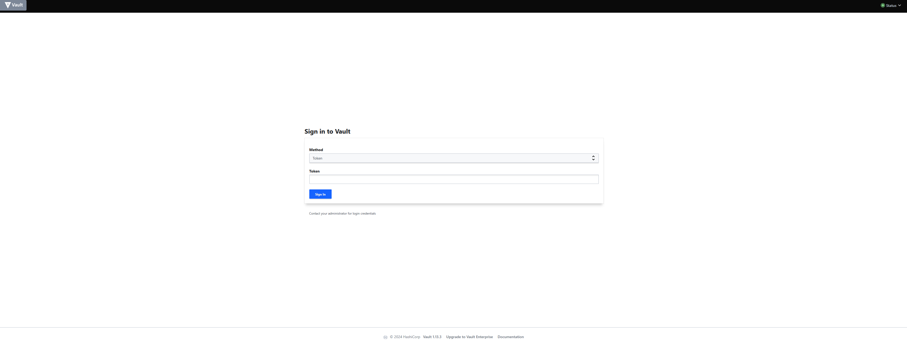
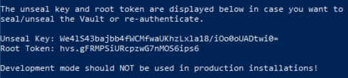
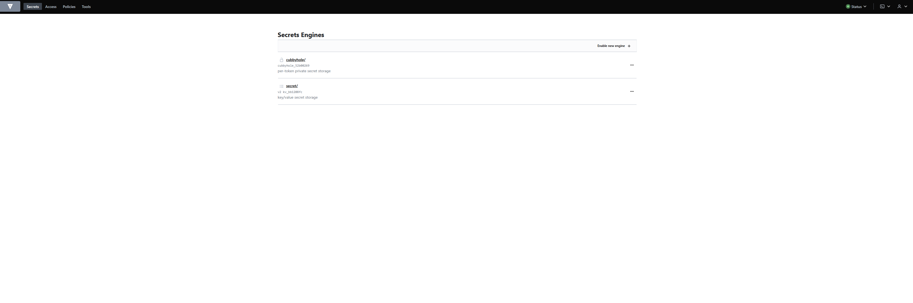
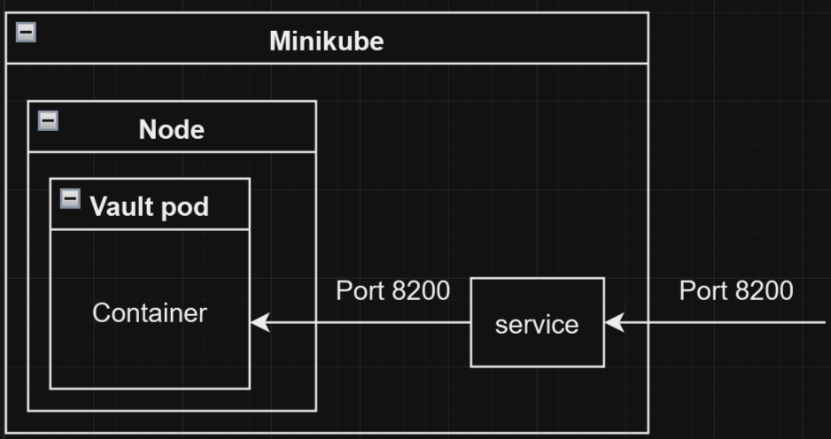

# Лабораторная работа №1  
**Установка Docker и Minikube, мой первый манифест.**

## Описание работы:
Это первая лабораторная работа, в которой вы сможете протестировать Docker, установить Minikube и развернуть свой первый "под".

## Цель работы:
Ознакомиться с инструментами Minikube и Docker, развернуть свой первый "под".

---

## Ход работы:

### 1. Установить Docker на рабочий компьютер  
Docker был установлен с официального сайта на операционную систему Windows 10.

---

### 2. Установить Minikube используя оригинальную инструкцию  
Minikube был установлен с официального сайта на операционную систему Windows 10.

---

### 3. Развернуть Minikube кластер  
После установки кластер был развернут командой - minikube start 
 

---

### 4. Загрузка образа HashiCorp Vault  
Образ был загружен командой:  
`docker pull vault:3.13.3`  
  

---

### 5. Написание манифеста для развертывания пода  
Для развертывания пода был написан манифест, изображённый на рисунке:  
 

Подключение манифеста выполнено командой:  
`kubectl apply -f "C:\Users\stoyr4\OneDrive\Вложения\Учеба\ИТМО\1 Семестр ИТМО\Распределенные технологии\лаба 1\vault.yaml"`  
  

---

### 6. Создание сервиса для доступа к контейнеру  
Создание сервиса было произведено командой:  
`minikube kubectl -- expose pod vault --type=NodePort --port=8200`  
 

---

### 7. Прокидывание порта  
Для доступа к контейнеру выполнена команда:  
`minikube kubectl -- port-forward service/vault 8200:8200`  

---

### 8. Открытие Vault  
После прокидывания порта становится возможным зайти в контейнер по адресу:  
[`http://localhost:8200`](http://localhost:8200)  
  

Для входа в Vault необходимо найти токен в логах с помощью команды:  
`minikube kubectl -- logs vault`  
  

Использование данного токена позволило успешно выполнить вход в Vault:  
  
*Рисунок 9 – вход в Vault*

---

### 9. Схема организации контейнеров  
  
*Рисунок 10 – схема организации контейнеров*
