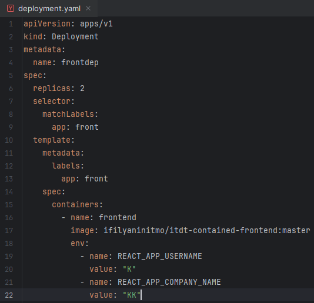
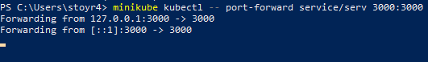
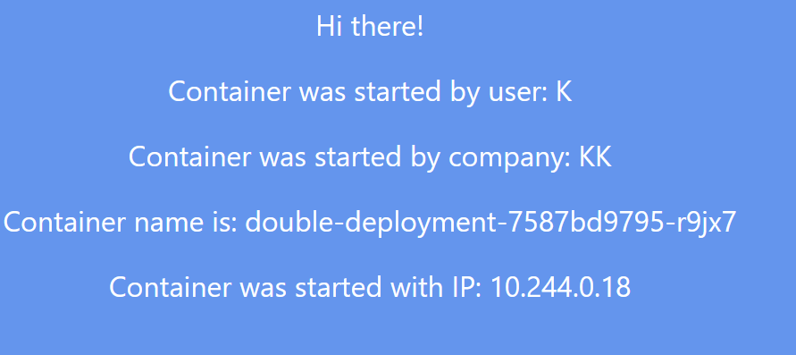
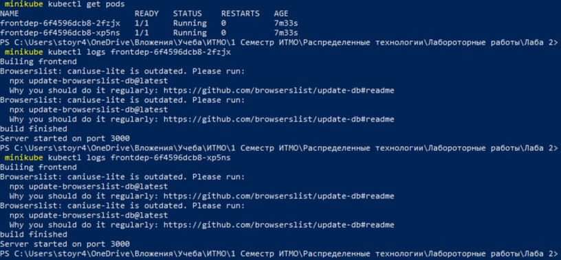
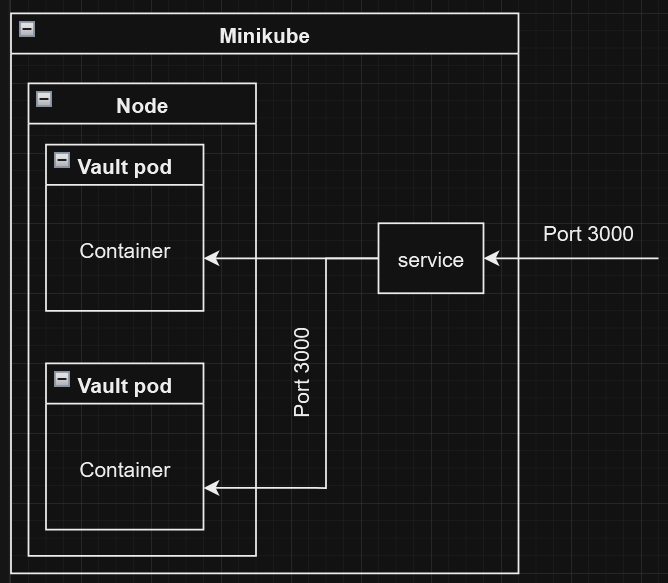

# Лабораторная работа №2  
**Развертывание веб-сервиса в Minikube, доступ к веб-интерфейсу сервиса, мониторинг сервиса.**

## Описание работы:
В данной лабораторной работе вы познакомитесь с развертыванием полноценного веб-сервиса с несколькими репликами.

## Цель работы:
Ознакомиться с типами "контроллеров" развертывания контейнеров, сетевыми сервисами и развернуть своё веб-приложение.

---

## Ход работы:

### 1. Создание Deployment  
Создан Deployment с двумя репликами контейнера:  
`ifilyaninitmo/itdt-contained-frontend:master`  
  

Манифест принят командой:  
`kubectl apply -f deployment.yaml`

Переданы переменные окружения:
- `REACT_APP_USERNAME`
- `REACT_APP_COMPANY_NAME`

---

### 2. Создание сервиса  
Сервис создан командой:  
`minikube kubectl -- expose deployment frontdep --port=3000 --name=serv --type=ClusterIP`

---

### 3. Проброс порта  
Проброс портов для подключения выполнен командой:  
`minikube kubectl -- port-forward service/service 3000:3000`  

---

### 4. Проверка  
Проверка работы сервиса выполнена по адресу:  
[`http://localhost:3000`](http://localhost:3000)  
  

---

### 5. Проверка логов контейнеров  
Для получения имён подов вызвана команда:  
`minikube kubectl get pods`  
Для вызова логов подов использовались команды:
- Логи первого пода:  
  `kubectl logs frontdep-6f4596dcb8-2fzjx`
- Логи второго пода:  
  `kubectl logs frontdep-6f4596dcb8-xp5ns`  

  

---

### 6. Схема  
  
