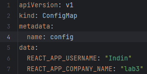
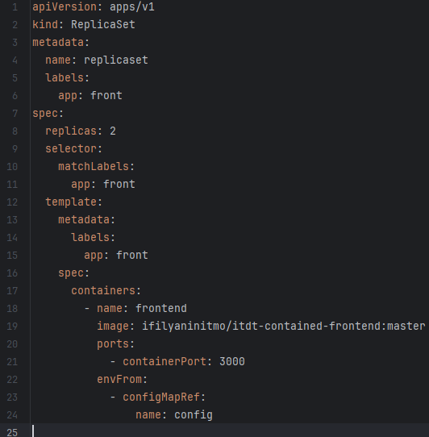
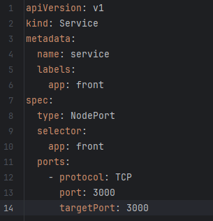
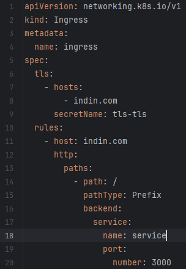
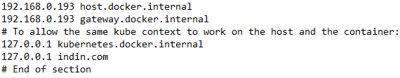
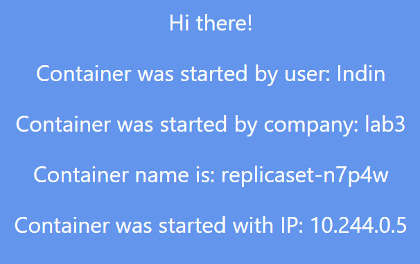
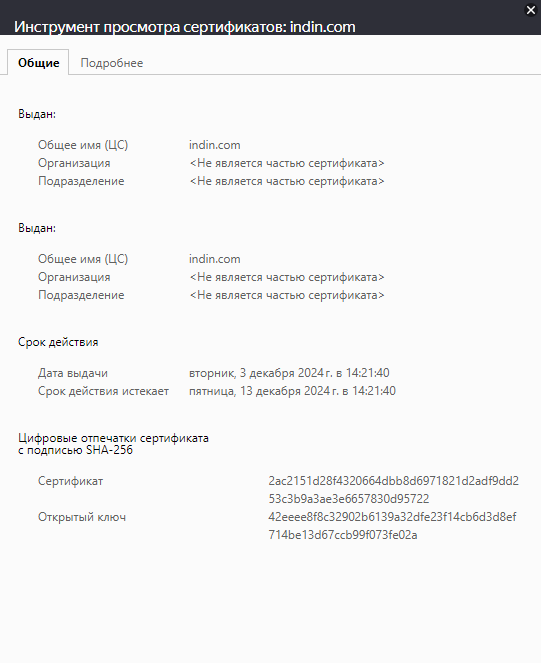
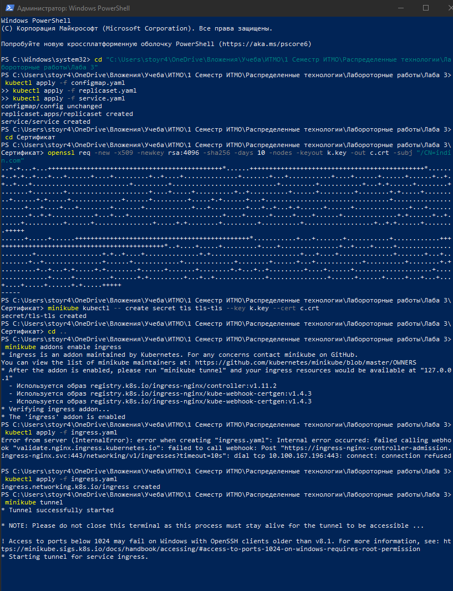
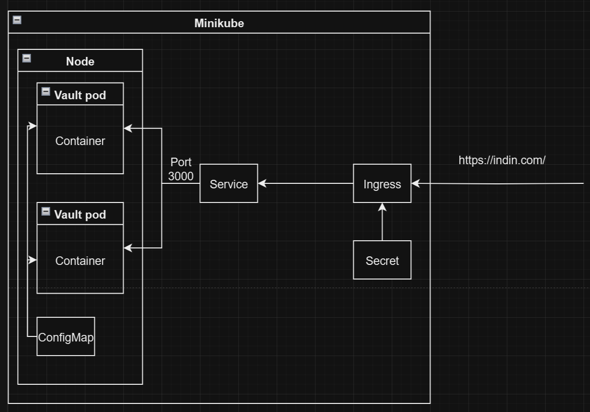

University: [ITMO University](https://itmo.ru/ru/)\
Faculty: [FICT](https://fict.itmo.ru)\
Course: [Introduction to distributed technologies](https://github.com/itmo-ict-faculty/introduction-to-distributed-technologies)\
Year: 2024/2025\
Group: K4111с\
Author: Indin Danila Nikolaevich\
Lab: Lab3\
Date of create: 03.12.2024\
Date of finished: 04.12.2024

# Лабораторная работа №3  
**Сертификаты и "секреты" в Minikube, безопасное хранение данных.**

## Описание:
В данной лабораторной работе вы познакомитесь с сертификатами и "секретами" в Minikube, а также с правилами безопасного хранения данных.

## Цель работы:
Познакомиться с сертификатами и "секретами" в Minikube, а также освоить правила безопасного хранения данных.

---

## Ход работы:

### 1. Создание ConfigMap  
Создан `ConfigMap` с переменными:  
- `REACT_APP_USERNAME`  
- `REACT_APP_COMPANY_NAME`

Манифест принят командой:  
`kubectl apply -f configmap.yaml`  
  

---

### 2. Создание ReplicaSet  
В манифесте прописано создание двух реплик с ссылкой на `ConfigMap` для объявления переменных окружения.  

Манифест принят командой:  
`kubectl apply -f replicaset.yaml`  
  

---

### 3. Создание Service  
Для доступа к подам создан сервис с указанием порта `3000`.  

Манифест принят командой:  
`kubectl apply -f service.yaml` 

  

---

### 4. Генерация TLS-сертификата  
Сертификат был сгенерирован командой
`openssl req -new -x509 -newkey rsa:4096 -sha256 -days 10 -nodes -keyout k.key -out c.crt -subj "/CN=indin.com".`
Далее сертификат был импортирован в minikube командой
`minikube kubectl -- create secret tls tls-tls --key k.key --cert c.crt.`

---

### 5 Создание Ingress
В начале был активирован ingress командой
`minikube addons enable ingress`
Далее был написан манифест для Ingress
Манифест был импортирован командой
`kubectl apply -f ingress.yaml`

---

### 5 Добавление FQDN в файл hosts
Для корректной работы системы, в файл hosts был добавлен FQDN 

---

### 5 Проверка результата
Для доступа к ingress была использована команда
`minikube tunnel`
После данной команды можно перейти по ссылке
`https://indin.com/`

Как видно из скриншота, все переменные совпадают с заданными.
На этой же странницы можно посмотреть сертификат безопасное 

Как видно из сертификата все заданные параметры совпадают с картинкой выше.
Ниже будет прикреплена история команд.

Схема

