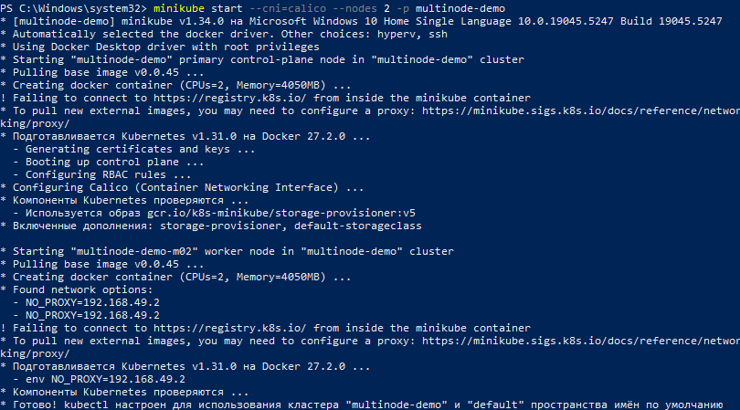
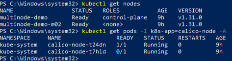

University: [ITMO University](https://itmo.ru/ru/)\
Faculty: [FICT](https://fict.itmo.ru)\
Course: [Introduction to distributed technologies](https://github.com/itmo-ict-faculty/introduction-to-distributed-technologies)\
Year: 2024/2025\
Group: K4111с\
Author: Indin Danila Nikolaevich\
Lab: Lab4\
Date of create: 20.12.2024\
Date of finished: 20.12.2024


# Лабораторная работа №3
**Сети связи в Minikube, CNI и CoreDNS**

## Описание:
Это последняя лабораторная работа в которой вы познакомитесь с сетями связи в Minikube. Особенность Kubernetes заключается в том, что у него одновременно работают underlay и overlay сети, а управление может быть организованно различными CNI.

## Цель работы:
Познакомиться с CNI Calico и функцией IPAM Plugin, изучить особенности работы CNI и CoreDNS.

---

## Ход работы:
### 1 Установка плагина calico и включение 2-х нод
Для создания кластера с данной конфигурацией была использована следующая команда
```bash
minikube start --cni=calico --nodes 2 -p multinode-demo
```


Проверка созданных нод и работы плагина calico
```bash
kubectl get nodes
```
```bash
kubectl get pods -l k8s-app=calico-node -A
```

 

Присваивание лейблов к нодам
```bash
kubectl label nodes multinode-demo zone=east
```
```bash
kubectl label nodes multinode-demo-m02 zone=west
```

---

### 2 Назначение IP адресов подам
Проверяем созданные Ippool по умолчанию
```bash
kubectl exec -i -n kube-system calicoctl -- /usr/bin/calicoctl --allow-version-mismatch get ippools -o wide
```
Для созднаия новых Ippool необходимо удалить Ippool по-умолчанию
```bash
kubectl delete ippools default-ipv4-ippool
```

