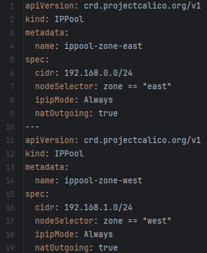
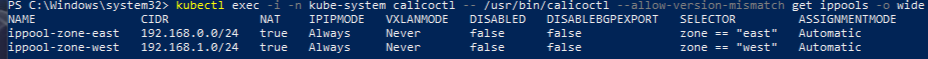
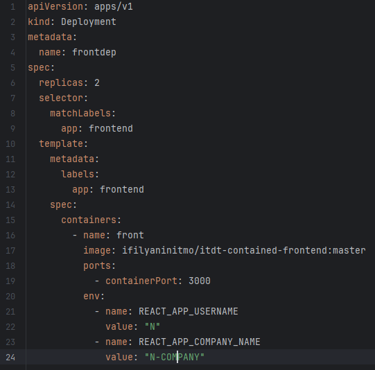
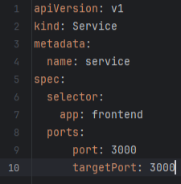
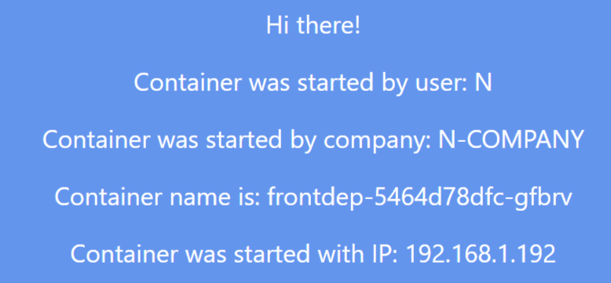
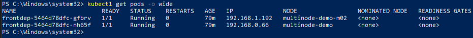
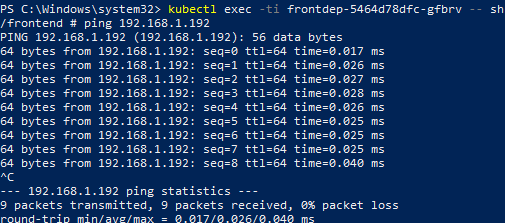
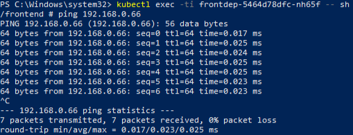
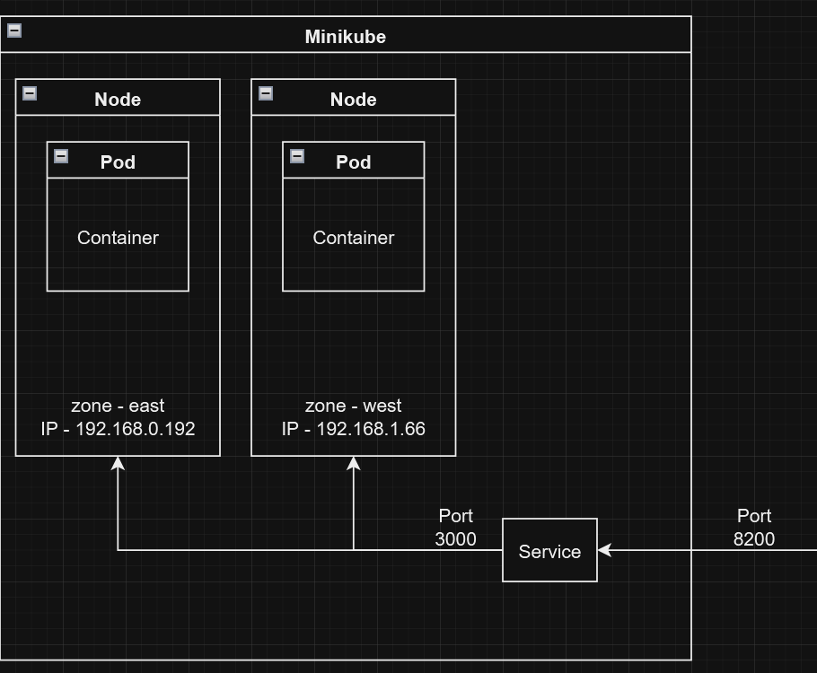

University: [ITMO University](https://itmo.ru/ru/)\
Faculty: [FICT](https://fict.itmo.ru)\
Course: [Introduction to distributed technologies](https://github.com/itmo-ict-faculty/introduction-to-distributed-technologies)\
Year: 2024/2025\
Group: K4111с\
Author: Indin Danila Nikolaevich\
Lab: Lab4\
Date of create: 20.12.2024\
Date of finished: 20.12.2024


# Лабораторная работа №3
**Сети связи в Minikube, CNI и CoreDNS**

## Описание:
Это последняя лабораторная работа в которой вы познакомитесь с сетями связи в Minikube. Особенность Kubernetes заключается в том, что у него одновременно работают underlay и overlay сети, а управление может быть организованно различными CNI.

## Цель работы:
Познакомиться с CNI Calico и функцией IPAM Plugin, изучить особенности работы CNI и CoreDNS.

---

## Ход работы:
### 1 Установка плагина calico и включение 2-х нод
Для созднаия кластера с необходимой конфигурацией была использована команда:
```bash
minikube start --cni=calico --nodes 2 -p multinode-demo
```


Проверка узлов и работы плагина Calico:
```bash
kubectl get nodes
```
```bash
kubectl get pods -l k8s-app=calico-node -A
```

 

Присваивание лейблов к нодам
```bash
kubectl label nodes multinode-demo zone=east
```
```bash
kubectl label nodes multinode-demo-m02 zone=west
```

---

### 2 Назначение IP адресов нодам
Для работы плагина необходимо установить утилиту calicoctl в Minicube.
это можно сделать с помощью команды:
```bash
kubectl apply -f https://raw.githubusercontent.com/projectcalico/calico/v3.29.1/manifests/calico.yaml
```
Или предварительно скачать YAML-файл из [репозитория](https://github.com/projectcalico/calico/tree/v3.27.5/manifests) и применить его:
```bash
kubectl apply -f calicoctl.yaml
```

Проверка существующего IPPool

Изначально в кластере уже создан IPPool по умолчанию. Проверить его можно с помощью команды:
```bash
kubectl exec -i -n kube-system calicoctl -- /usr/bin/calicoctl --allow-version-mismatch get ippools -o wide
```
Удаление IPPool по умолчанию и создание нового

Для создания новых IPPool необходимо сначала удалить существующий, после чего написать и применить манифест IPpool:
```bash
kubectl delete ippools default-ipv4-ippool
```
 

Манифест для IPpool принимается командой:
```bash
kubectl apply -f calicoctl.yaml
```
Проверка новых IPPool

После создания IPPool необходимо убедиться, что появилось два новых пула. Для этого используется команда:
```bash
kubectl exec -i -n kube-system calicoctl -- /usr/bin/calicoctl --allow-version-mismatch get ippools -o wide
```
 

---

### 3 deployment
Манифест для deployment

 

Принимаем манифест
```bash
kubectl apply -f deployment.yaml
```

---

### 4 Service
Манифесть для service



Принимаем манифест
```bash
kubectl apply -f service.yaml
```

---

### 5 Проверка результата
После подключения всех компонентов, подбрасываем порт командой
```bash
kubectl port-forward service/service 8200:3000
```
Перейдя по адресу http://localhost:8200/, можно увидеть веб-страницу, где будут отображены значения переменных REACT_APP_USERNAME и REACT_APP_COMPANY_NAME, а также назначенный IP-адрес.

Для проверки доступности подов и их IP-адресов пропингуем их
Но для начала необходимо определить название подов:
```bash
kubectl get pods -o wide
```


Пинг первого пода:
```bash
kubectl exec -ti frontdep-5464d78dfc-gfbrv -- sh
ping 192.168.1.192
```


Пинг второго пода:
```bash
kubectl exec -ti frontdep-5464d78dfc-nh65f -- sh
ping 192.168.0.66
```


Схема организации контейнеров представлена ниже:

